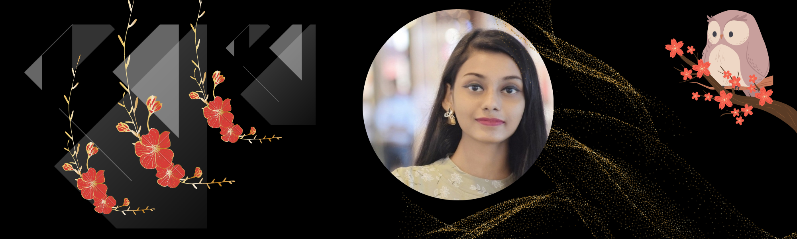

<h1 align="center">Greetings! I'm Janhawi Paswan.</h1>
<h3 align="center">Self-taught UI/UX Designer from India. By staying attuned to the dynamic UI/UX terrain, my objective is to provide inventive and enchanting encounters that surpass user anticipations.</h3>

📝 I regularly write articles on [https://medium.com/@genialjam](https://medium.com/@genialjam)

📫 How to reach me **Janhawipaswan@gmail.com**

<h3 align="left">Connect with me:</h3>

  
<h3 align="left">Connect with me:</h3>

</a>
</a>
</a>

<h3 align="left">🤖 Artificial Intelligence and Bots:</h3>

<h3 align="left">📝 Blog:</h3>

<h3 align="left">🎨 Design:</h3>

</a>
</a>
</a>

<h3 align="left">🕹️ Favourite Game Consoles:</h3>

</a>
</a>

